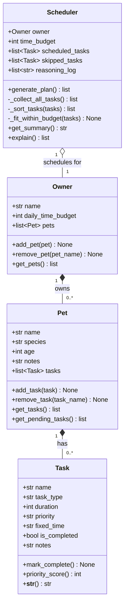

# PawPal+ Project Reflection

## 1. System Design

**a. Initial design**

**Three core actions a user should be able to perform:**

1. **Register an owner and add a pet** — A user provides their name and available daily time budget, then adds a pet with its name, species, age, and any special notes (e.g., "needs medication twice a day"). This sets up the context the scheduler will use when making decisions.

2. **Add and edit care tasks** — A user creates tasks for a pet (walk, feeding, medication, grooming, enrichment) by specifying the task type, estimated duration in minutes, and a priority level (high / medium / low). They can also edit or remove existing tasks. This gives the scheduler its raw input.

3. **Generate and view today's daily plan** — A user requests a scheduled plan for the day. The system sorts and fits tasks into the owner's available time window, respects priority and any hard time constraints (e.g., medication at a fixed hour), and displays the ordered schedule with a short explanation of why each task was placed where it was.

**UML class design (initial):**

- `Owner` — stores owner name, daily time budget (minutes), and holds a list of `Pet` objects. Responsible for profile management.
- `Pet` — stores pet name, species, age, and notes. Holds a list of `Task` objects assigned to that pet.
- `Task` — stores task type, duration, priority, optional fixed time, and completion status. Encapsulates a single care action.
- `Scheduler` — accepts an `Owner` (and its pets/tasks) plus a time budget, runs the scheduling algorithm, and returns an ordered list of `Task` objects with a reasoning log.

**b. Building blocks — attributes and methods**

---

**`Owner`**

| Category | Name | Description |
|----------|------|-------------|
| Attribute | `name: str` | Owner's full name |
| Attribute | `daily_time_budget: int` | Total minutes available per day for pet care |
| Attribute | `pets: list[Pet]` | All pets belonging to this owner |
| Method | `add_pet(pet)` | Append a Pet to the owner's list |
| Method | `remove_pet(pet_name)` | Remove a pet by name |
| Method | `get_pets()` | Return all pets |

---

**`Pet`**

| Category | Name | Description |
|----------|------|-------------|
| Attribute | `name: str` | Pet's name |
| Attribute | `species: str` | e.g., "dog", "cat", "rabbit" |
| Attribute | `age: int` | Age in years |
| Attribute | `notes: str` | Special care notes (e.g., "allergic to chicken") |
| Attribute | `tasks: list[Task]` | Care tasks assigned to this pet |
| Method | `add_task(task)` | Append a Task to the pet's list |
| Method | `remove_task(task_name)` | Remove a task by name |
| Method | `get_tasks()` | Return all tasks |
| Method | `get_pending_tasks()` | Return only incomplete tasks |

---

**`Task`**

| Category | Name | Description |
|----------|------|-------------|
| Attribute | `name: str` | Descriptive label (e.g., "Morning Walk") |
| Attribute | `task_type: str` | Category: walk / feeding / medication / grooming / enrichment |
| Attribute | `duration: int` | Estimated minutes to complete |
| Attribute | `priority: str` | `"high"`, `"medium"`, or `"low"` |
| Attribute | `fixed_time: str \| None` | Optional hard start time like `"08:00"` |
| Attribute | `is_completed: bool` | Whether the task has been done today |
| Attribute | `notes: str` | Optional extra info |
| Method | `mark_complete()` | Set `is_completed = True` |
| Method | `priority_score()` | Return a sortable int (high=3, medium=2, low=1) |
| Method | `__str__()` | Human-readable summary of the task |

---

**`Scheduler`**

| Category | Name | Description |
|----------|------|-------------|
| Attribute | `owner: Owner` | Owner whose pets/tasks are being scheduled |
| Attribute | `time_budget: int` | Available minutes (copied from owner) |
| Attribute | `scheduled_tasks: list[Task]` | Ordered tasks that fit within the budget |
| Attribute | `skipped_tasks: list[Task]` | Tasks dropped because time ran out |
| Attribute | `reasoning_log: list[str]` | Plain-language notes explaining each decision |
| Method | `generate_plan()` | Main entry point — runs the full algorithm, returns scheduled list |
| Method | `_collect_all_tasks()` | Gather pending tasks from all pets |
| Method | `_sort_tasks(tasks)` | Sort: fixed-time tasks first, then by priority (high→low), then by shortest duration |
| Method | `_fit_within_budget(tasks)` | Greedy pass — add tasks until time budget is exhausted |
| Method | `get_summary()` | Return a formatted string of the final plan |
| Method | `explain()` | Return the reasoning log as a list of strings |

**c. UML Class Diagram (Mermaid.js)**

**Relationship review:**
- `Owner *-- Pet` (composition): pets only exist in the context of an owner — if the owner is removed, so are their pets.
- `Pet *-- Task` (composition): tasks belong to a specific pet and don't exist independently.
- `Scheduler o-- Owner` (aggregation): the scheduler uses an owner to read pets and tasks, but doesn't own or destroy the owner.
- No unnecessary complexity: `Task` has no sub-types yet (medication vs. walk behave the same in the algorithm — differentiated only by `task_type` string and `fixed_time`). A subclass would only be warranted if behavior diverges.

---

**d. Design changes**

Yes — reviewing the skeleton against the UML revealed three issues that required changes before implementation begins.

**Change 1 — Added `pet_name: str` to `Task`**

The original UML had no link from `Task` back to its parent `Pet`. When `Scheduler._collect_all_tasks()` flattens all pets' tasks into a single list, the pet context is lost. The scheduler's summary and reasoning log would only be able to say "Morning Walk (20min)" with no way to identify which pet the task belongs to.

Adding `pet_name: str = ""` to `Task` (defaulting to empty so existing constructors are unaffected) means `_collect_all_tasks()` can stamp each task as it collects it. This avoids needing a circular back-reference (`task.pet`) or a more complex data structure like a list of `(task, pet)` tuples throughout the scheduler.

**Change 2 — Stubs return safe empty values instead of `None`**

Both `_collect_all_tasks()` and `_sort_tasks()` ended with `pass`, which means they return `None`. Since `generate_plan()` immediately pipes their return values into the next call (`_sort_tasks(all_tasks)`, then `_fit_within_budget(sorted_tasks)`), calling `generate_plan()` before the stubs are implemented would crash with a `TypeError`. Changed both stubs to return `[]` / `return tasks` respectively so the pipeline is safe to call at any stage of development.

**Change 3 — Documented that `time_budget` must not be mutated during scheduling**

The original design listed `time_budget` as a single attribute serving two roles: storing the initial daily budget (for display) and tracking the remaining time during `_fit_within_budget` (decreasing counter). These two roles conflict — mutating `time_budget` while scheduling would make the original budget unavailable for the summary. Added a note to `_fit_within_budget`'s docstring that a local `remaining` variable must be used for the counter, keeping `self.time_budget` constant.

---

## 2. Scheduling Logic and Tradeoffs

**a. Constraints and priorities**

The scheduler considers three constraints, in this order of precedence:

1. **Fixed time** — tasks with a `fixed_time` (e.g. medication at `"08:00"`) are always scheduled first, sorted by clock time. A missed medication is not the same as a missed play session; hard times must be respected regardless of priority level.
2. **Priority** — among flexible tasks, `high` tasks are scheduled before `medium`, which come before `low`. This is expressed numerically via `priority_score()` (high=3, medium=2, low=1) so the sort key is a single integer comparison.
3. **Duration (tie-breaking)** — within the same priority tier, shorter tasks are scheduled first. This maximises the number of tasks that fit inside a tight time budget (greedy by count, not by duration).

The daily time budget is the hard outer constraint — tasks that don't fit are moved to `skipped_tasks`, not dropped silently.

**b. Tradeoffs**

**Tradeoff: greedy first-fit scheduling instead of optimal knapsack**

The scheduler uses a greedy algorithm: it walks the sorted task list in order and adds each task if it fits in the remaining budget. This is fast (O(n)) and its reasoning is transparent — the log says exactly why each task was scheduled or skipped.

The optimal alternative would be a 0/1 knapsack dynamic-programming algorithm, which considers all possible subsets of tasks and finds the combination that maximises total priority value within the time budget. For example, if the budget is 30 minutes and the remaining tasks are one 20min high-priority task and two 15min medium-priority tasks, the greedy approach picks the 20min task (highest priority) and has no room for the 15min tasks, leaving 10 minutes unused. The knapsack approach would pick the two 15min tasks instead, fitting perfectly and potentially delivering more combined value depending on how priority is weighted.

This tradeoff is reasonable for a daily pet care schedule because:
- The task list is short (typically fewer than 15 items), so O(n²) knapsack overhead would be invisible, but the greedy output is easier to explain to the user.
- Pet care has a natural priority ordering (medication > feeding > walking > grooming) that the greedy approach already respects. An optimal algorithm might deprioritise a medication task because three grooming tasks together score higher in aggregate — which is the wrong outcome for this domain.
- Transparent reasoning matters: the owner can read "SKIPPED: Nail trim (20min needed, only 10min left)" and understand the decision. An optimal algorithm's reasoning is harder to summarise in plain language.

---

## 3. AI Collaboration

**a. How you used AI**

- How did you use AI tools during this project (for example: design brainstorming, debugging, refactoring)?
- What kinds of prompts or questions were most helpful?

**b. Judgment and verification**

- Describe one moment where you did not accept an AI suggestion as-is.
- How did you evaluate or verify what the AI suggested?

---

## 4. Testing and Verification

**a. What you tested**

- What behaviors did you test?
- Why were these tests important?

**b. Confidence**

- How confident are you that your scheduler works correctly?
- What edge cases would you test next if you had more time?

---

## 5. Reflection

**a. What went well**

- What part of this project are you most satisfied with?

**b. What you would improve**

- If you had another iteration, what would you improve or redesign?

**c. Key takeaway**

- What is one important thing you learned about designing systems or working with AI on this project?
