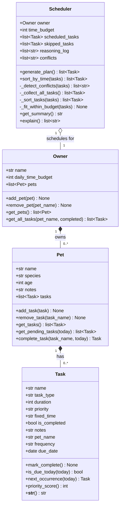

# PawPal+ Project Reflection

## 1. System Design

**a. Initial design**

**Three core actions a user should be able to perform:**

1. **Register an owner and add a pet** — A user provides their name and available daily time budget, then adds a pet with its name, species, age, and any special notes (e.g., "needs medication twice a day"). This sets up the context the scheduler will use when making decisions.

2. **Add and edit care tasks** — A user creates tasks for a pet (walk, feeding, medication, grooming, enrichment) by specifying the task type, estimated duration in minutes, and a priority level (high / medium / low). They can also edit or remove existing tasks. This gives the scheduler its raw input.

3. **Generate and view today's daily plan** — A user requests a scheduled plan for the day. The system sorts and fits tasks into the owner's available time window, respects priority and any hard time constraints (e.g., medication at a fixed hour), and displays the ordered schedule with a short explanation of why each task was placed where it was.

**UML class design (initial):**

- `Owner` — stores owner name, daily time budget (minutes), and holds a list of `Pet` objects. Responsible for profile management.
- `Pet` — stores pet name, species, age, and notes. Holds a list of `Task` objects assigned to that pet.
- `Task` — stores task type, duration, priority, optional fixed time, and completion status. Encapsulates a single care action.
- `Scheduler` — accepts an `Owner` (and its pets/tasks) plus a time budget, runs the scheduling algorithm, and returns an ordered list of `Task` objects with a reasoning log.

**b. Building blocks — attributes and methods**

---

**`Owner`**

| Category | Name | Description |
|----------|------|-------------|
| Attribute | `name: str` | Owner's full name |
| Attribute | `daily_time_budget: int` | Total minutes available per day for pet care |
| Attribute | `pets: list[Pet]` | All pets belonging to this owner |
| Method | `add_pet(pet)` | Append a Pet to the owner's list |
| Method | `remove_pet(pet_name)` | Remove a pet by name |
| Method | `get_pets()` | Return all pets |

---

**`Pet`**

| Category | Name | Description |
|----------|------|-------------|
| Attribute | `name: str` | Pet's name |
| Attribute | `species: str` | e.g., "dog", "cat", "rabbit" |
| Attribute | `age: int` | Age in years |
| Attribute | `notes: str` | Special care notes (e.g., "allergic to chicken") |
| Attribute | `tasks: list[Task]` | Care tasks assigned to this pet |
| Method | `add_task(task)` | Append a Task to the pet's list |
| Method | `remove_task(task_name)` | Remove a task by name |
| Method | `get_tasks()` | Return all tasks |
| Method | `get_pending_tasks()` | Return only incomplete tasks |

---

**`Task`**

| Category | Name | Description |
|----------|------|-------------|
| Attribute | `name: str` | Descriptive label (e.g., "Morning Walk") |
| Attribute | `task_type: str` | Category: walk / feeding / medication / grooming / enrichment |
| Attribute | `duration: int` | Estimated minutes to complete |
| Attribute | `priority: str` | `"high"`, `"medium"`, or `"low"` |
| Attribute | `fixed_time: str \| None` | Optional hard start time like `"08:00"` |
| Attribute | `is_completed: bool` | Whether the task has been done today |
| Attribute | `notes: str` | Optional extra info |
| Method | `mark_complete()` | Set `is_completed = True` |
| Method | `priority_score()` | Return a sortable int (high=3, medium=2, low=1) |
| Method | `__str__()` | Human-readable summary of the task |

---

**`Scheduler`**

| Category | Name | Description |
|----------|------|-------------|
| Attribute | `owner: Owner` | Owner whose pets/tasks are being scheduled |
| Attribute | `time_budget: int` | Available minutes (copied from owner) |
| Attribute | `scheduled_tasks: list[Task]` | Ordered tasks that fit within the budget |
| Attribute | `skipped_tasks: list[Task]` | Tasks dropped because time ran out |
| Attribute | `reasoning_log: list[str]` | Plain-language notes explaining each decision |
| Method | `generate_plan()` | Main entry point — runs the full algorithm, returns scheduled list |
| Method | `_collect_all_tasks()` | Gather pending tasks from all pets |
| Method | `_sort_tasks(tasks)` | Sort: fixed-time tasks first, then by priority (high→low), then by shortest duration |
| Method | `_fit_within_budget(tasks)` | Greedy pass — add tasks until time budget is exhausted |
| Method | `get_summary()` | Return a formatted string of the final plan |
| Method | `explain()` | Return the reasoning log as a list of strings |

**c. UML Class Diagram (Mermaid.js)**

**Relationship review (final):**
- `Owner *-- Pet` (composition): unchanged — pets belong to one owner and don't exist independently.
- `Pet *-- Task` (composition): unchanged — tasks belong to one pet.
- `Scheduler o-- Owner` (aggregation): unchanged — the scheduler reads from the owner without owning it.
- `Task` gained three new fields (`pet_name`, `frequency`, `due_date`) and two new methods (`is_due_today`, `next_occurrence`) — still no sub-types needed because behaviour varies only by field values, not method logic.
- `Scheduler` gained one new public method (`sort_by_time`), one new private method (`_detect_conflicts`), and one new attribute (`conflicts`) — the algorithm's surface area grew but the relationships between classes did not change.

---

**d. Design changes**

Yes — reviewing the skeleton against the UML revealed three issues that required changes before implementation begins.

**Change 1 — Added `pet_name: str` to `Task`**

The original UML had no link from `Task` back to its parent `Pet`. When `Scheduler._collect_all_tasks()` flattens all pets' tasks into a single list, the pet context is lost. The scheduler's summary and reasoning log would only be able to say "Morning Walk (20min)" with no way to identify which pet the task belongs to.

Adding `pet_name: str = ""` to `Task` (defaulting to empty so existing constructors are unaffected) means `_collect_all_tasks()` can stamp each task as it collects it. This avoids needing a circular back-reference (`task.pet`) or a more complex data structure like a list of `(task, pet)` tuples throughout the scheduler.

**Change 2 — Stubs return safe empty values instead of `None`**

Both `_collect_all_tasks()` and `_sort_tasks()` ended with `pass`, which means they return `None`. Since `generate_plan()` immediately pipes their return values into the next call (`_sort_tasks(all_tasks)`, then `_fit_within_budget(sorted_tasks)`), calling `generate_plan()` before the stubs are implemented would crash with a `TypeError`. Changed both stubs to return `[]` / `return tasks` respectively so the pipeline is safe to call at any stage of development.

**Change 3 — Documented that `time_budget` must not be mutated during scheduling**

The original design listed `time_budget` as a single attribute serving two roles: storing the initial daily budget (for display) and tracking the remaining time during `_fit_within_budget` (decreasing counter). These two roles conflict — mutating `time_budget` while scheduling would make the original budget unavailable for the summary. Added a note to `_fit_within_budget`'s docstring that a local `remaining` variable must be used for the counter, keeping `self.time_budget` constant.

---

## 2. Scheduling Logic and Tradeoffs

**a. Constraints and priorities**

The scheduler considers three constraints, in this order of precedence:

1. **Fixed time** — tasks with a `fixed_time` (e.g. medication at `"08:00"`) are always scheduled first, sorted by clock time. A missed medication is not the same as a missed play session; hard times must be respected regardless of priority level.
2. **Priority** — among flexible tasks, `high` tasks are scheduled before `medium`, which come before `low`. This is expressed numerically via `priority_score()` (high=3, medium=2, low=1) so the sort key is a single integer comparison.
3. **Duration (tie-breaking)** — within the same priority tier, shorter tasks are scheduled first. This maximises the number of tasks that fit inside a tight time budget (greedy by count, not by duration).

The daily time budget is the hard outer constraint — tasks that don't fit are moved to `skipped_tasks`, not dropped silently.

**b. Tradeoffs**

**Tradeoff: greedy first-fit scheduling instead of optimal knapsack**

The scheduler uses a greedy algorithm: it walks the sorted task list in order and adds each task if it fits in the remaining budget. This is fast (O(n)) and its reasoning is transparent — the log says exactly why each task was scheduled or skipped.

The optimal alternative would be a 0/1 knapsack dynamic-programming algorithm, which considers all possible subsets of tasks and finds the combination that maximises total priority value within the time budget. For example, if the budget is 30 minutes and the remaining tasks are one 20min high-priority task and two 15min medium-priority tasks, the greedy approach picks the 20min task (highest priority) and has no room for the 15min tasks, leaving 10 minutes unused. The knapsack approach would pick the two 15min tasks instead, fitting perfectly and potentially delivering more combined value depending on how priority is weighted.

This tradeoff is reasonable for a daily pet care schedule because:
- The task list is short (typically fewer than 15 items), so O(n²) knapsack overhead would be invisible, but the greedy output is easier to explain to the user.
- Pet care has a natural priority ordering (medication > feeding > walking > grooming) that the greedy approach already respects. An optimal algorithm might deprioritise a medication task because three grooming tasks together score higher in aggregate — which is the wrong outcome for this domain.
- Transparent reasoning matters: the owner can read "SKIPPED: Nail trim (20min needed, only 10min left)" and understand the decision. An optimal algorithm's reasoning is harder to summarise in plain language.

---

## 3. AI Collaboration

**a. How you used AI**

Claude was used as a collaborative engineering partner across every phase of the project, but the role it played shifted depending on the task:

- **Phase 1 (Design):** Used for brainstorming the class structure — specifically asking "what information does each object need to hold, and what actions should it perform?" Claude's suggestions were treated as a starting point, not a final answer. The four-class design (`Task`, `Pet`, `Owner`, `Scheduler`) emerged from back-and-forth refinement rather than a single prompt.
- **Phase 2–3 (Implementation):** Used to fill in method bodies once the skeleton was agreed upon. The most effective prompts were specific: *"implement `_fit_within_budget` using a greedy approach with a local `remaining` counter — do NOT mutate `self.time_budget`"* rather than vague ones like *"implement the scheduler."* Specificity forced Claude to respect constraints that came from my own design decisions, not its defaults.
- **Phase 4 (Algorithms):** Used to identify which parts of the codebase were too manual or fragile. Asking *"review these methods for readability and performance — tell me which ones could be simplified without sacrificing clarity"* produced a useful prioritised list. The `range(len(...))` → `itertools.combinations` refactor in `_detect_conflicts` and the nested list comprehension in `get_all_tasks` came directly from this review.
- **Phase 5 (Testing):** Used to generate test stubs for Phase 4 behaviours (sort-by-time, recurring tasks, conflict detection). The most useful prompt pattern was: *"write tests for X — include one happy-path test and one edge case that would catch a silent regression."* The `test_single_digit_hour_sorts_before_double_digit` test is a direct product of this — it would immediately catch any regression back to raw string sort.

The most consistently effective prompt pattern across all phases was framing questions as architecture constraints rather than open-ended requests: *"given that X must not happen, implement Y"* rather than *"implement Y."*

**b. Judgment and verification**

The clearest moment of not accepting a suggestion as-is was during the `_detect_conflicts` method. Claude's first draft used a `range(len(timed))` double-loop with index arithmetic. The code was functionally correct, but I replaced it with `itertools.combinations(timed, 2)` because:

1. The `combinations` version makes the intent explicit — "check every unique pair" — without the reader needing to mentally parse the index bounds.
2. It eliminated three lines of noise (`for i in range(len(timed))`, `for j in range(i+1, len(timed))`, plus two index lookups) that obscured the actual overlap condition.

The verification step was running the conflict detection demo in `main.py` before and after the change, confirming that the same two conflicts were flagged with identical warning messages. Passing the full test suite (`python -m pytest`) gave additional confidence that the refactor introduced no regressions.

A second moment was rejecting Claude's initial suggestion to make `Scheduler` a subclass of `Owner` (on the grounds that "a Scheduler is a specialised Owner"). That relationship is wrong: a Scheduler *uses* an Owner; it is not a kind of Owner. Inheritance would have made it impossible to reuse a Scheduler across different owners, and would have violated the single-responsibility principle. The aggregation relationship (`Scheduler o-- Owner`) was the correct design and was kept throughout.

---

## 4. Testing and Verification

**a. What you tested**

The 34-test suite covers five distinct categories of behaviour:

1. **Core data integrity** (`TestTask`, `TestPet`): `mark_complete()` flips the right flag, `priority_score()` returns the correct integers, `add_task()` and `remove_task()` keep the task list consistent, and `get_pending_tasks()` filters correctly by completion status. These tests matter because the entire scheduler depends on these methods — a silent bug here would corrupt every plan silently.

2. **Scheduling contracts** (`TestScheduler`): High-priority tasks appear before low-priority ones, fixed-time tasks appear before flexible ones, tasks exceeding the budget land in `skipped_tasks`, and an owner with no pets produces an empty plan. These tests encode the core promise of the system — if any of them fail, the scheduler is no longer doing what it claims.

3. **Sorting correctness** (`TestSortByTime`): The critical test here is `test_single_digit_hour_sorts_before_double_digit` — it would catch a regression back to raw string sort, where `"9:00"` incorrectly sorts after `"10:00"`. Without this test, such a regression could go unnoticed until a user reports medication being scheduled hours late.

4. **Recurring task logic** (`TestRecurringTasks`): Eight tests covering daily/weekly/once recurrence, the `timedelta` date arithmetic, and the critical edge case that a task due tomorrow must not appear in today's pending list. This last test is the safety net that makes the entire recurring-task feature safe to ship.

5. **Conflict detection** (`TestConflictDetection`): The adjacent-tasks test (`end_a == start_b` → no conflict) is particularly important. The overlap condition `start_a < end_b AND start_b < end_a` uses strict inequality deliberately — a non-strict version would incorrectly flag valid back-to-back scheduling as a conflict.

**b. Confidence**

★★★★☆ — confident the core logic is correct; two gaps remain open.

The scheduler's main contracts are all tested against pinned inputs (fixed dates, fixed budgets, fixed task sets), so the tests don't depend on the real clock or real randomness. This makes the suite reproducible and trustworthy.

The two edge cases worth testing next:
- **Input validation for `fixed_time`**: a value like `"8am"` would crash `sort_by_time()` with an unhelpful `ValueError`. A test asserting a descriptive error message would close this gap and prevent confusing runtime crashes in the UI.
- **End-to-end integration**: no test currently runs the full pipeline (Owner → Pet → Task → Scheduler → `generate_plan()`) with recurring tasks active across two simulated days. A multi-step test that completes a daily task on Day 1 and verifies the next instance appears in Day 2's plan would close the most significant untested integration path.

---

## 5. Reflection

**a. What went well**

The part of the project I am most satisfied with is the `Scheduler` class's design — specifically the decision to keep `_fit_within_budget` as a plain greedy loop with a local `remaining` counter and a human-readable reasoning log. It would have been easy to make the scheduler more "clever" (optimal knapsack, constraint-satisfaction, etc.), but a complex algorithm would have made the output harder to explain to a non-technical user. The reasoning log — *"SCHEDULED Morning walk (30min, high) — 45min remaining"* — is something an owner can actually read and trust. That transparency was the right call for this domain.

The test for the string-sort regression (`"9:00"` vs `"10:00"`) is also satisfying — it is a test that would fail on a naive implementation and pass only on the correct one. Tests like this have real value as regression guards, not just coverage metrics.

**b. What you would improve**

In a next iteration, I would redesign how `fixed_time` is stored. Currently it is a raw string (`"08:00"`), which means parsing and validation are scattered across `sort_by_time` and the Streamlit form. A better design would store it as `datetime.time` on the `Task` object directly, with validation at construction time. This would eliminate the `split(":")` parsing in `sort_by_time`, make `_detect_conflicts` cleaner (no anchor-date conversion needed), and surface format errors at the moment a bad value is entered rather than at scheduling time.

I would also add a `reset_day()` method to `Pet` that clears `is_completed` on all `"once"` tasks and moves recurring tasks forward — this would make the multi-day workflow complete without requiring manual task management between days.

**c. Key takeaway**

The most important thing I learned is that **AI makes you a faster architect, but only if you arrive as an architect first.** When prompts were vague ("implement the scheduler"), the output required significant rework. When prompts encoded a specific design constraint ("use a local `remaining` counter — do not mutate `self.time_budget`"), the output was immediately usable.

The moments where AI saved the most time were not the moments of writing code — they were moments of *reviewing* code: asking "what is fragile about this?" or "which version is more readable?" Those prompts turned Claude into a code reviewer rather than a code generator, which produced more durable improvements. The `range(len)` → `combinations` refactor and the `get_all_tasks` list comprehension both came from this kind of review prompt, not from a generation prompt.

The lead architect's job in an AI-assisted project is to hold the design invariants — the decisions about *why* the code is structured the way it is — while delegating the expression of those decisions to the AI. That division of labour is what made it possible to build a four-class scheduling system with 34 tests across six phases without losing track of the original design intent.
